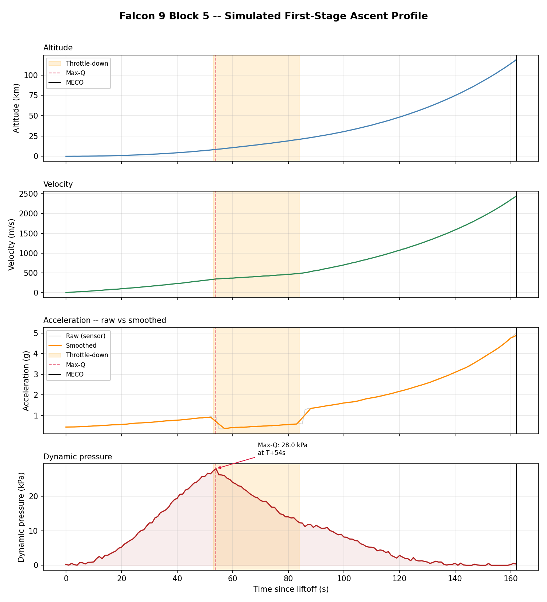

# Aerospace ML

**Machine learning for flight hardware: predicting engine failures, analysing flight data, and building the physics tools underneath.**

[](https://github.com/markabena/Aerospace-ML/actions/workflows/tests.yml)

I'm Mark Abena, an aerospace engineering graduate (B.Eng, Air Force Institute of Technology, Kaduna, 2026). This repository is my working portfolio for applied ML in aerospace. It holds a flagship predictive-maintenance project on NASA engine data and a foundations track of five tools that build up to it, from rocket equations to a trained classifier.

Every project here follows the same rules:

- **Checked against reference values.** Physics results are compared with published numbers, and those checks run in CI.
- **Honest about data.** Real datasets are cited. Simulated data is labelled as simulated.
- **Reproducible.** One `requirements.txt` and a test suite that runs on every push.

---

## Flagship: Turbofan Remaining Useful Life Prediction

**[`projects/01_turbofan_rul`](projects/01_turbofan_rul/)** · NASA C-MAPSS · 🔵 In progress (phases C1–C2 of 5 complete)

This project predicts how many cycles an aircraft engine has left before failure, using run-to-failure sensor data. Errors are not symmetric: over-predicting remaining life keeps a failing engine in service. The evaluation is built around that.

Work so far:

- **Data pipeline** for C-MAPSS's headerless, whitespace-padded format, tested against mock files that reproduce its quirks.
- **RUL labelling** with a piecewise-linear cap at 125 cycles, so the model isn't trained to see degradation before it starts.
- **116 engineered features**: rolling means, standard deviations and trend slopes over 5- and 20-cycle windows, plus deviation from each engine's own baseline. The best engineered feature reaches |r| = 0.819 with RUL, against 0.775 for the best raw sensor.
- **Data-driven sensor selection** that catches `sensor_6`, a sensor with non-zero variance but only two distinct values across 20,631 rows.
- **Leakage tests** that prove no rolling window crosses between engines or looks forward in time.

Next: random forest and gradient boosting baselines scored with NASA's asymmetric function (C3), then an LSTM (C4).

---

## Foundations Track

**[`foundations/`](foundations/)** holds five tools built in sequence. Each one adds a skill the capstone needs.

| # | Project | What it does | Result |
|---|---------|--------------|--------|
| P1 | [Rocket Performance Evaluator](foundations/p1_rocket_performance/) | Δv, burn time, TWR and apogee from vehicle parameters, with GO/ABORT checks | Tsiolkovsky and energy-method models |
| P2 | [Orbital Parameter Calculator](foundations/p2_orbital_parameters/) | Circular and elliptical orbits via vis-viva | Matches ISS, GEO and GTO reference values |
| P3 | [Flight Data Analyser](foundations/p3_flight_data_analyser/) | Cleans noisy ascent telemetry and detects max-Q, throttle-down and MECO | Max-Q 28.0 kPa at T+54 s |
| P4 | [Flight Visualiser](foundations/p4_flight_visualiser/) | Annotated four-panel ascent profile | See below |
| P5 | [Engine Health Monitor](foundations/p5_engine_health_monitor/) | Random forest that flags degraded engines from static-fire sensors | 90% of degraded engines caught; 98% accuracy vs an 85% baseline |



---

## Roadmap

| # | Project | Domain | Status |
|---|---------|--------|--------|
| 01 | [Turbofan RUL Prediction](projects/01_turbofan_rul/) | Predictive maintenance | 🔵 In progress |
| 02 | [Spacecraft Telemetry Anomaly Detection](projects/02_telemetry_anomaly/) | Flight operations (NASA SMAP/MSL) | 🟡 Planned |
| 03 | [CFD Icing Surrogate Model](projects/03_cfd_icing_surrogate/) | Aerodynamics | 🟡 Planned |
| 04 | [Aviation Regulations RAG Assistant](projects/04_aviation_rag/) | LLMs for aviation compliance | 🟡 Planned |

---

## Repository Layout

```
Aerospace-ML/
├── projects/        # Main ML projects, one self-contained folder each
├── foundations/     # P1–P5: the build-up track, physics tools to a first classifier
├── tests/           # Repo-wide checks, run in CI on every push
├── docs/            # Learning log
└── requirements.txt
```

## Run It

Requires **Python 3.11**.

```bash
git clone https://github.com/markabena/Aerospace-ML.git
cd Aerospace-ML
pip install -r requirements.txt
pytest                      # runs every check in the repo
```

Each project's README explains how to run it on its own. The turbofan project needs the NASA dataset; see its [data guide](projects/01_turbofan_rul/data/README.md).

**Stack:** Python · NumPy · pandas · scikit-learn · matplotlib · pytest · MATLAB (via CSV interchange)

---

MIT License. See [LICENSE](LICENSE).
